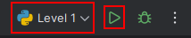
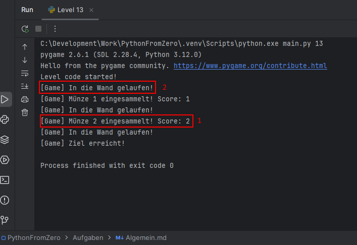

# Learn Python from Zero

## Ziel

In jedem level geht es darum den Spieler zum "Exit" Schild zu bewegen und auf dem Weg alle Münzen aufzusammeln.


## Ein Level Starten

Um ein Level zu starten, kannst du oben rechts auf `Level x` drücken und ein Beliebiges Level das du starten möchtest auswählen.
Danach einfach auf den Grünen Play Button drücken.



Wen das Program gestartet ist und du das SPiel siehst kannst du mit der `Leertaste` den Code starten.

Probier es doch einmal aus, indem du das Level 0 startest und laufen lässt.

## Die Konsole

Die Konsole befindet sich unten und sollte sich automatisch öffnen beim Starten des programs (ansonsten unbedingt fragen).
Die Konsole sieht etwa so aus:



In der Konsole werden Informationen angezeigt. Viel davon kannst du Ignorieren, für dich ist nur Interessant was mit `[Game]`
anfängt. Diese geben dir Informationen über das Spiel, wie:

1. Ob du eine Münze eingesammelt hast
2. Wen du in eine Wand gelaufen bist.

## Code

Jedes Level hat ein File mit einer Anleitung und Aufgabe für dieses Level. 
Dazu hat es ein python file bereit in dem `code` Ortner. Jedes python file sieht ungefähr so aus

```python
from main import move_left, move_right, move_up, move_down, get_position


def main():

    # hier kommt dein code

    return

```

Das musst du alles nicht verstehen. Die Aufgaben werden Schritt für Schritt alles erklären.
Das Wichtige für jetzt ist das dein Code, den du schreiben wirst, kommt unterhalb von `# here kommt dein code`.
Zusätzlich ist es wichtig, dass die Einrückung der Zeilen stimmt, ansonsten wird dein code nicht funktionieren.
Achte einfach darauf das dein code den du schreibst, gleich weit eingerückt ist wie der Hashtag `#`.

Also ein beispiel wäre:

```python
from main import move_left, move_right, move_up, move_down, get_position


def main():

    # hier kommt dein code
    move_left()

    return
```

### Kommentare

In python kann man Kommentare machen. Ein Kommentar ist alles, was nach dem `#` kommt. Ein Kommentar wird vom Program
nicht ausgeführt. Du kannst also in einem Kommentar alles schreiben.

Wen du irgendwo etwas wie `# hier kommt dein code` siehst, ist das ein Kommentar, der dir zeigen soll, dass du hier dein Code
schreiben kannst. Beachte dabei, dass dein Code dann gleich weit nach rechts eingerückt sein muss wie der Kommentar.