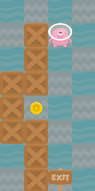

# Learn Python from Zero

## Ziel

In jedem level geht es darum den Spieler zum "Exit" Schild zu bewegen und auf dem Weg alle Münzen aufzusammeln.



## Code

Jedes Level hat ein File mit einer Anleitung und Aufgabe für dieses Level. 
Dazu hat es ein python file bereit in dem `code` Ortner. Jedes python file sieht ungefähr so aus

```python
from main import move_left, move_right, move_up, move_down, get_position


def main():

    # here kommt dein code

    return

```

Das musst du alles nicht verstehen. Die Aufgaben werden Schritt für Schritt alles erklären.
Das Wichtige für jetzt ist das dein Code, den du schreiben wirst, kommt unterhalb von `# here kommt dein code`.
Zusätzlich ist es wichtig, dass die Einrückung der Zeilen stimmt, ansonsten wird dein code nicht funktionieren.
Achte einfach darauf das dein code den du schreibst, gleich weit eingerückt ist wie der Hashtag `#`.

Also ein beispiel wäre:

```python
from main import move_left, move_right, move_up, move_down, get_position


def main():

    # here kommt dein code
    move_left()

    return
```